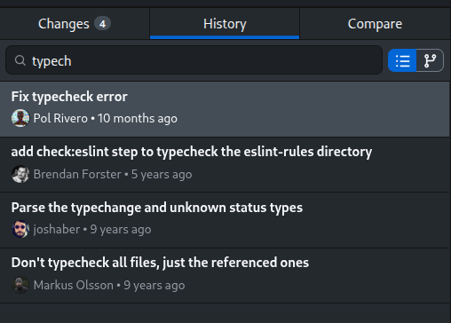
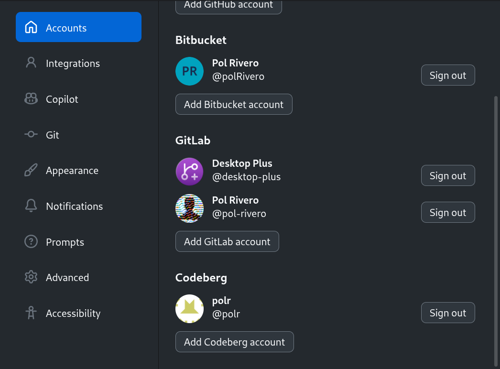
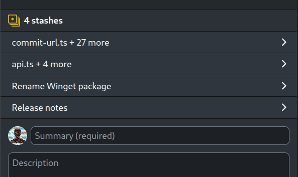
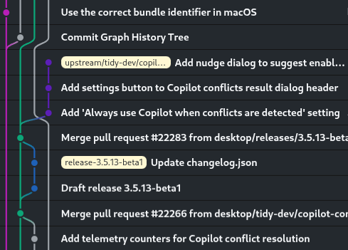
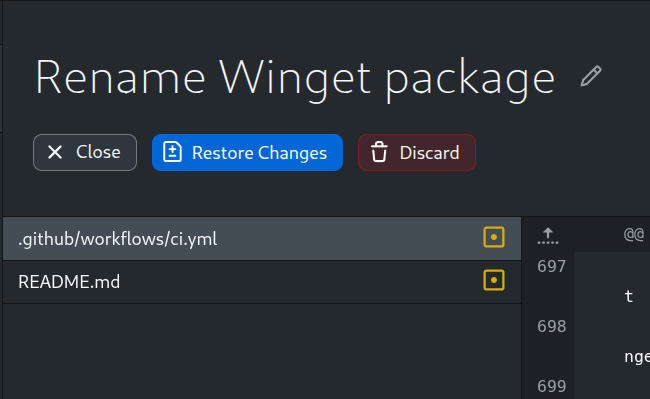
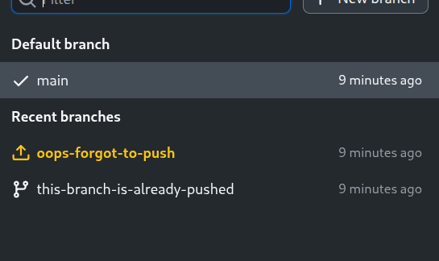

# GH Desktop Claw

This is an **up-to-date** fork of [GitHub Desktop](https://desktop.github.com) with additional features and improvements.

> [!IMPORTANT]
> This is a community-maintained project. It **is not** an official GitHub product. 

## Highlights 👀
| <h4>Search commits by title, message, tag, or hash</h4> | <h4>Rich integration with all major Git platforms [^1]</h4> |
| :---: | :---: |
|  |  |
| <h4>Create multiple stashes per branch</h4> | <h4>Visualize the Commit Graph</h4> |
|  |  |
| <h4>Buttons optimized for visual recognition</h4> | <h4>Quickly find unpushed branches</h4> |
|  |  |

[^1]: Rich integration with GitHub, GitHub Enterprise, Bitbucket Cloud, GitLab Cloud, self-hosted GitLab, Codeberg Cloud, self-hosted Forgejo, Gitea Cloud, and self-hosted Gitea. Multi-account support is available for all of them (e.g., sign in to multiple GitHub accounts at the same time).

## Additional Features in Desktop Claw ✨

**See the [full list of features here](https://desktop-plus.org/#feature-list).**

<details>
<summary>See demo video</summary>

<video src="https://github.com/user-attachments/assets/a1be6c03-8773-4608-be13-152b5e12c5a9"></video>

</details>

## Download and Installation 📦

### Windows

<details>
<summary>Click to expand</summary>

#### Option 1: Using Winget (Recommended)

```powershell
winget install DesktopClaw.DesktopClaw
```

To update, run `winget upgrade DesktopClaw.DesktopClaw` or `winget upgrade --all` to update all your winget packages. Make sure to update regularly to get the latest features and fixes.

#### Option 2: Manual download (Not recommended)

Download and execute the installer from the [releases page](https://github.com/desktop-plus/desktop-plus/releases/latest).

| | **64-bit x86** | **64-bit ARM** |
| --- | --- | --- |
| **.EXE Installer** | `-win-x64.exe` | `-win-arm64.exe` |
| **.MSI Installer ⚠️** | `-win-x64.msi` | `-win-arm64.msi` |

Please note that the app doesn't auto-update like the official GitHub Desktop, so you will need to manually download and install it every time you want to update.  
For this reason, **I recommend using Winget instead of the manual download**.

⚠️ The MSI installer is meant for enterprise deployments and is not recommended for regular users. If you want to use it, keep in mind that you will need to reboot your computer to finish the installation. The MSI installer only registers a hook that will install the app on login.

---

</details>

### macOS

<details>
<summary>Click to expand</summary>

#### Option 1: Using Homebrew (Recommended)

```bash
brew install desktop-plus/tap/desktop-claw
```

Make sure to run `brew update` + `brew upgrade` regularly to get the latest updates for Desktop Claw.

#### Option 2: Manual download (Not recommended)

Download and extract the ZIP file from the [releases page](https://github.com/desktop-plus/desktop-plus/releases/latest). Click the app file to run it.  
If you encounter the error "Apple could not verify this app is free of malware", go to "System Settings" > "Privacy & Security", scroll down to "Security" and click "Open Anyway" on "Desktop Claw".

| **64-bit x86** | **64-bit ARM (Apple Silicon)** |
| --- | --- |
| `-macOS-x64.zip` | `-macOS-arm64.zip` |

Please note that the app doesn't auto-update like the official GitHub Desktop, so you will need to manually download it every time you want to update.  
For this reason, I recommend using Homebrew instead of the manual download.

---

</details>

### Debian · Ubuntu · Mint · Pop!_OS · Zorin · elementary OS (APT)

<details>

<summary>Click to expand</summary>
<br>

Create the repository file:

```bash
sudo curl https://gpg.desktop-plus.org/public.key | sudo gpg --dearmor -o /usr/share/keyrings/desktop-claw.gpg
echo "deb [arch=amd64,arm64 signed-by=/usr/share/keyrings/desktop-claw.gpg] https://apt.desktop-plus.org/ stable main" | sudo tee /etc/apt/sources.list.d/desktop-claw.list
```

Update the package list and install:
```bash
sudo apt update
sudo apt install desktop-claw
```

---

</details>


### Fedora · RHEL · CentOS Stream · Rocky Linux · AlmaLinux (RPM)

<details>
<summary>Click to expand</summary>

#### Option 1: Using the official repository (Recommended)

Create the repository file:

```bash
sudo rpm --import https://gpg.desktop-plus.org/public.key
echo -e "[desktop-claw]\nname=Desktop Claw\nbaseurl=https://rpm.desktop-plus.org/\nenabled=1\ngpgcheck=1\nrepo_gpgcheck=1\ngpgkey=https://gpg.desktop-plus.org/public.key" | sudo tee /etc/yum.repos.d/desktop-claw.repo
```

Update the package list and install:

```bash
sudo dnf check-update --refresh
sudo dnf install desktop-claw
```

#### Option 2: Using [Terra](https://terrapkg.com/)

Make sure you have [installed](https://docs.terrapkg.com/usage/installing/) or enabled the Terra repository. Then, run:
```bash
sudo dnf install desktop-claw-bin
```

> **Note:** The Terra package is unofficial. Use at your own risk.


---

</details>

### OpenSUSE (RPM)

<details>
<summary>Click to expand</summary>
<br>

Create the repository file:

```bash
sudo rpm --import https://gpg.desktop-plus.org/public.key
echo -e "[desktop-claw]\nname=Desktop Claw\nbaseurl=https://rpm.desktop-plus.org/\nenabled=1\ngpgcheck=1\nrepo_gpgcheck=1\ngpgkey=https://gpg.desktop-plus.org/public.key" | sudo tee /etc/zypp/repos.d/desktop-claw.repo
```

Update the package list and install:

```bash
sudo zypper refresh
sudo zypper install desktop-claw
```

---

</details>


### Arch Linux · EndeavourOS · Garuda Linux · Manjaro (AUR)

<details>
<summary>Click to expand</summary>
<br>

Simply install `desktop-claw-bin` from the AUR using your preferred AUR helper.

```sh
yay -S desktop-claw-bin
```

You can also build from source by installing `desktop-claw` or `desktop-claw-git` from the AUR.

> `gnome-keyring` is required and the daemon must be launched either at login or when the X server / Wayland compositor is started. Normally this is handled by a display manager, but in other cases following the instructions found on the [Arch Wiki](https://wiki.archlinux.org/index.php/GNOME/Keyring#Using_the_keyring_outside_GNOME) will fix the issue of not being able to save login credentials.

---

</details>


### Flatpak (any distro)

<details>
<summary>Click to expand</summary>
<br>

Simply install Desktop Claw from [Flathub](https://flathub.org/en/apps/org.desktop_plus.desktop-plus):

```bash
flatpak install flathub org.desktop_plus.desktop-plus
```

> **NOTE:** Git hooks will run inside the Flatpak sandbox and cannot access programs installed on your system (such as version managers,
> linters, or other tools your hooks rely on). If your hooks depend on such programs, install a native package instead.

---

</details>

### AppImage (any distro, not recommended)

<details>
<summary>Click to expand</summary>
<br>

**IMPORTANT:** I strongly recommend using your distribution's native package (APT, RPM, and AUR packages above) or Flatpak instead of the AppImage, as it requires some manual setup for the sign-in feature to work.  
If you need to use the AppImage, follow these steps:
1. Manually [create a `desktop-claw.desktop` entry](https://wiki.archlinux.org/title/Desktop_entries).
2. Link the MIME type:
   ```sh
   xdg-mime default desktop-claw.desktop x-scheme-handler/x-github-desktop-auth
   ```

#### Option 1: Using ["AM"/"AppMan"](https://github.com/ivan-hc/AM)

```bash
# If using "AM":
am install github-desktop-plus
# If using "AppMan":
appman install github-desktop-plus
```

> **Note:** The AM/AppMan package is unofficial. Use at your own risk.

#### Option 2: Manual download (Not recommended)

Download the AppImage from the [releases page](https://github.com/desktop-plus/desktop-plus/releases/latest):

| **64-bit x86** | **64-bit ARM** |
| --- | --- |
| `-linux-x86_64.AppImage` | `-linux-arm64.AppImage` |

Then, make it executable:

```bash
chmod +x DesktopClaw-*-linux-*.AppImage
```

Finally, double-click the .AppImage file to run it.

---

</details>

## Common issues 🛠️

Before opening a new issue, please check the [Known Issues](docs/documentation/known-issues.md) document for common issues and their workarounds.

## Command Line Interface 💻

Desktop Claw includes a CLI (`desktop-claw-cli`) for opening and cloning repositories from the terminal. See the [CLI documentation](docs/documentation/cli.md) for usage details and instructions on creating a shorter alias.

## Running the app locally 🏗️

### From the terminal

```bash
corepack enable  # Install yarn if needed
yarn             # Install dependencies
yarn build:dev   # Initial build
yarn start       # Start the app for development and watch for changes
```

- It's normal for the app to take a while to start up, especially the first time.

- While starting up, this error is normal: `UnhandledPromiseRejectionWarning: Error: Invalid header: Does not start with Cr24`

- You don't need to restart the app to apply changes. Just reload the window (`Ctrl + Alt + R` / `Cmd + Alt + R`).

- Changes to the code inside `main-process` do require a full rebuild. Stop the app and run `yarn build:dev` again.

- [Read this document](docs/documentation/contributing/setup.md) for more information on how to set up your development environment.

### From VSCode

The first time you open the project, install the dependencies by running:
```bash
corepack enable
yarn
```

Then, you can simply build and run the app by pressing `F5`.  
Breakpoints should be set in the developer tools, not the VSCode editor.

### Running tests

I recommend running the tests in a Docker container for reproducibility and to avoid conflicts with your git configuration.  
After installing the dependencies with `yarn`, make sure you have Docker installed and run:

```bash
yarn test:docker
```

## Why this fork?

First, because [shiftkey's fork](https://github.com/shiftkey/desktop) is currently unmaintained (the last commit was in February 2025), so all Linux users are no longer getting the latest features and fixes from the official GitHub Desktop repository.

Secondly, I think the official GitHub Desktop app is very slow in terms of updates and lacks some advanced features that I'd like. This fork has low code quality requirements compared to the official repo, so I (and hopefully you as well) can add features and improvements quickly.  
This fork also focuses on integrating nicely with Bitbucket, since I use it for work and haven't found a good Linux GUI client for it.

Keep in mind that this version is not endorsed by GitHub, and it's aimed at power users with technical knowledge. If you're looking for a polished and stable product, I recommend using the official GitHub Desktop app instead.

## Acknowledgments 🙏

Application icon adapted from [`git-branch-plus`](https://lucide.dev/icons/git-branch-plus) by [Lucide](https://lucide.dev), [ISC license](https://github.com/lucide-icons/lucide/blob/main/LICENSE).
